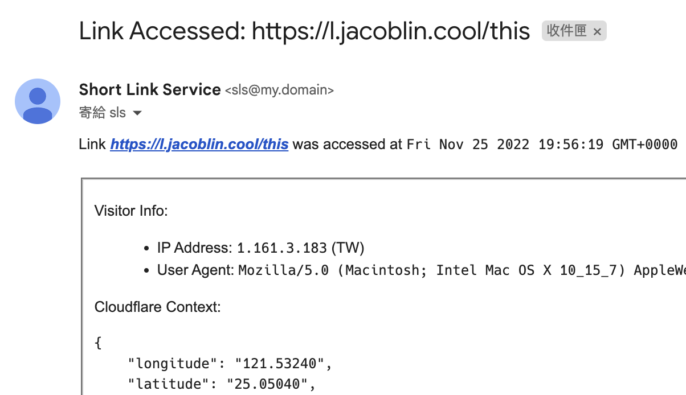

# Short Link Service

Short link service powered by [Cloudflare Workers](https://workers.cloudflare.com/).

## Features

### Create a short link

### Create a short link with PIN

### List all links & Delete a link

### Notify when a link is accessed

If you want to be notified when a link is accessed, you can set `EMAIL_NOTIFY` environment variable to your email address.

You will receive an email with visitor's IP address, user agent, and Cloudflare request context.

Like this:

And you can also set `DISCORD_NOTIFY` environment variable to your Discord webhook URL if you want to receive a notification in Discord.

## Deploy

It is a Cloudflare Worker!

You can simply fork this repo and do the following steps:

1. [optional] Install [Pnpm](https://pnpm.io/installation)
2. `pnpm i` - Install dependencies
3. `pnpm pub` - Publish to Cloudflare Workers
4. Set the `PASS` environment variable in Cloudflare Workers dashboard

Done!
